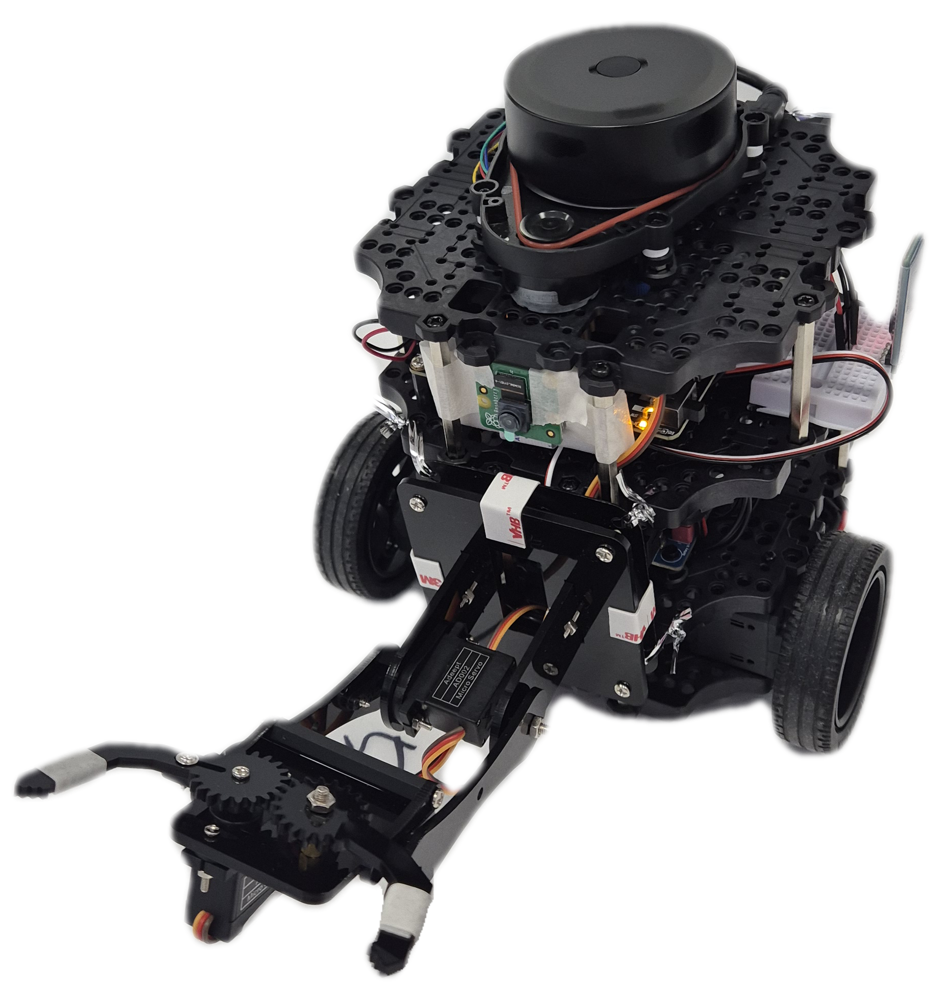

# 🏋️ PTSD - 헬스장 정리 로봇 시스템  
📅 **프로젝트 기간:** 2025.04.14 ~ 2025.05.22  

> 💡 이제 기구 정리는 PTSD가 합니다 – **운동은 하고, 정리는 맡기세요** 💪

---
1. **[프로젝트 소개](#프로젝트-소개)**
2. **[기술 스택](#기술-스택)**
3. **[주요 기능](#주요-기능)**
4. **[시스템 아키텍쳐](#시스템-아키텍쳐)**
5. **[동작](#동작)**
6. **[서비스 화면](#서비스-화면)**
7. **[팀원 소개](#팀원-소개)**

 

## 프로젝트 소개

헬스 트레이너 분들과의 현장 인터뷰를 통해  
**운동 후 정리하지 않는 무거운 원판을 매번 사람이 옮기는 불편함**을 확인하게 되었습니다.

반복되는 수작업 정리, 무거운 기구 재배치, 트레이너의 과도한 부담…

이러한 실제 헬스장 운영자들의 고충을 해결하기 위해,  
기구를 자동으로 감지하고 정리하는 **자율 주행 헬스 정리 로봇**,  
**PTSD (Put Things Smartly Down)** 프로젝트를 기획·개발하게 되었습니다.

> 🚀 **웹 기술 + AI + IoT + ROS** 기반으로  
> **사용자의 운동 편의성 + 트레이너의 업무 부담**을 동시에 줄이는  
> 스마트한 헬스장 정리 솔루션입니다.

 

## 기술 스택
### ✔️Frond-end
        

### ✔️Back-end
      

### ✔️Infra  
        

### ✔️HardWare
      

### ✔️Collaboration  
        

 

## 주요 기능 

|         기능         | 내용                                                                     |
| :----------------: | :--------------------------------------------------------------------- |
|    **AI 기반 운동기구 탐지**   | 딥러닝(YOLO 등)을 활용하여 정리되지 않은 덤벨, 원판 등 다양한 운동기구를 실시간으로 식별하고 분류             |
|  **실내 지도 작성 및 자율 주행**  | SLAM 기반으로 실내 공간을 자동으로 맵핑하고, 생성된 경로를 따라 장애물을 피하면서 목적지까지 자율 주행           |
|   **운동기구 자동 운반 및 정리**  | 탐지된 기구를 로봇팔로 집어 정해진 위치로 이동시켜 자동 정리 수행                                  |
|  **로봇 상태 및 작업 이력 조회**  | 로봇의 현재 상태(시작, 완료 등)를 확인할 수 있으며, 최근 작업 내역은 로그로 저장되어 이력 관리 가능      |
|   **예약 기반 자동 정리 작업**   | 운영자가 원하는 시간에 로봇이 자동으로 정리 작업을 수행하도록 예약 기능 제공, 반복 일정 또는 일회성 스케줄 설정 가능    |               |
|  **자율주행 + 로봇팔 통합 제어**  | 탐지 → 경로 이동 → 집기 → 정리까지 로봇의 자율주행 시스템과 로봇팔을 통합하여 전 과정을 자동화               |

 

## 시스템 아키텍쳐
 

 

 

## 동작

### 🤖 터틀봇 기반 헬스장 정리 로봇 제작

|  |
|:---:|

- **터틀봇3**과 **로봇팔**을 결합

---

### 👁️ 객체 인식

<table>
  <tr>
    <td style="text-align: center;">
       
      객체인식-(1)
    </td>
    <td style="text-align: center;">
       
      객체인식-(2)
    </td>
  </tr>
</table>

- YOLOv8모델을 이용해서 운동기구를 덤벨, 원판클래스로 분류 후 탐지
- 식별한 운동기구의 크기와 위치정보를 로봇에 송신
- OpenCV를 이용해 영상 처리결과를 수신

---

### 🚗 자율 주행
|  | 
|:---:|
| 자율주행 시연 장면 |

- SLAM 또는 사전 지정된 경로 기반 주행
- 장애물 감지 및 회피

---

### 🦾 로봇팔 제어
<table>
  <tr>
    <td style="text-align: center;">
       
      거치대 바벨 정리
    </td>
    <td style="text-align: center;">
       
      바닥 바벨 회수
    </td>
  </tr>
</table>

- 로봇팔의 관절(Joint)을 제어하여 물체를 정확히 집어 올림
- 지정된 위치로 이송 및 배치

## 서비스 화면

### 🔐 회원가입 & 로그인

  

> 📝 사용자 이메일과 비밀번호를 통해 로그인  
> ✅ 로그인 시도 시 입력값 유효성 검사  
> 🔗 가입 링크 제공으로 신규 사용자 접근 용이

---

### 🔧 기기 등록 (로봇 연결)

  

> 🤖 최초 로그인 시 등록 안내 문구 표시  
> 📡 사용 가능한 로봇 기기 목록에서 연결  
> ✅ 연결 후 실시간 상태 확인 (connected)

---

### 🔋 배터리 상태 및 맵 확인

  

> ⚡ 로봇 충전 상태(%) 실시간 확인  
> 🗺️ **터틀봇 기반 헬스장 맵** 제공  
> 🧸 캐릭터 UI로 친근한 상태 전달

---

### 📊 기기 상태 대시보드

  

> ✅ 연결 상태, 배터리 잔량 확인  
> ⏰ 청소 예약 상태 표시  
> 🚨 최근 알림 내역 (예: 배터리 부족)

---

### ⏰ 청소 예약 등록

  

> 🕒 원하는 시간에 **여러 개 예약 등록 가능**  
> 🔄 예약 항목 온오프 스위치 조절  
> ➕ "+" 버튼으로 예약 추가

---

### 📅 예약 타이머 설정

  

> ⏳ **몇 시간 뒤 자동 종료** 타이머 설정  
> 🔁 플레이 탭과 연동되어 자동 정리 종료

---

### ▶️ 플레이 탭

  

> 🧠 로봇 동작 자동 제어 시작  
> 🏠 복귀 명령 (정해진 위치로 이동)  
> 🛠 수동 제어 기능:  
> &nbsp;&nbsp;&nbsp;&nbsp;- 팔 상하 이동  
> &nbsp;&nbsp;&nbsp;&nbsp;- 집게 열기/닫기  
> &nbsp;&nbsp;&nbsp;&nbsp;- 상하좌우 이동

---

### ☰ 메뉴 (기기 및 계정 관리)

  <table>
    <tr>
      <td align="center">
         
      </td>
      <td align="center">
         
      </td>
    </tr>
  </table>

> ⚙️ 기기 연결, 사용 설명서 확인  
> 🔕 알림 설정, 자주 묻는 질문(FAQ)  
> 🔐 로그아웃 / 계정 삭제 지원

---

 

## 팀원 소개

<table>
  <tbody>
    <tr>
      <td align="center">
        <a href="#"> 
        <b>HardWare : 정준탁 jjt6759@gmail.com</b></a> 
      </td>
      <td align="center">
        <a href="#"> 
        <b>HardWare : 김진우 swjinu0125@gmail.com</b></a> 
      </td>
      <td align="center">
        <a href="#"> 
        <b>Frontend : 김태호 cosmos21233@gmail.com</b></a> 
      </td>
      <td align="center">
        <a href="#"> 
        <b>Frontend : 임정인 harperim127@gmail.com</b></a> 
      </td>
    </tr>
    <tr>
      <td align="center">
        <a href="#"> 
        <b>Backend : 이지현 ww4277777@gmail.com</b></a> 
      </td>
      <td align="center">
        <a href="#"> 
        <b>Ai : 최미연 mu05041@naver.com</b></a> 
      </td>
      <td align="center">
        <a href="#"> 
        <b>Infra,Backend : 최연지 rokmc17047200@gmail.com</b></a> 
      </td>
    </tr>
  </tbody>
</table>

 

